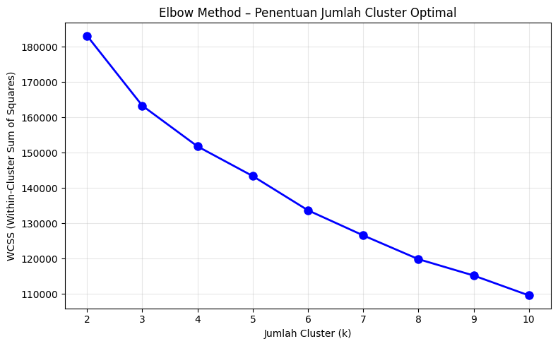
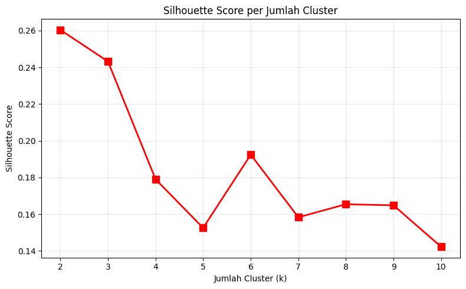
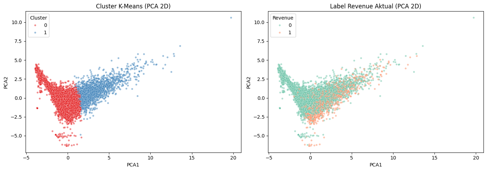
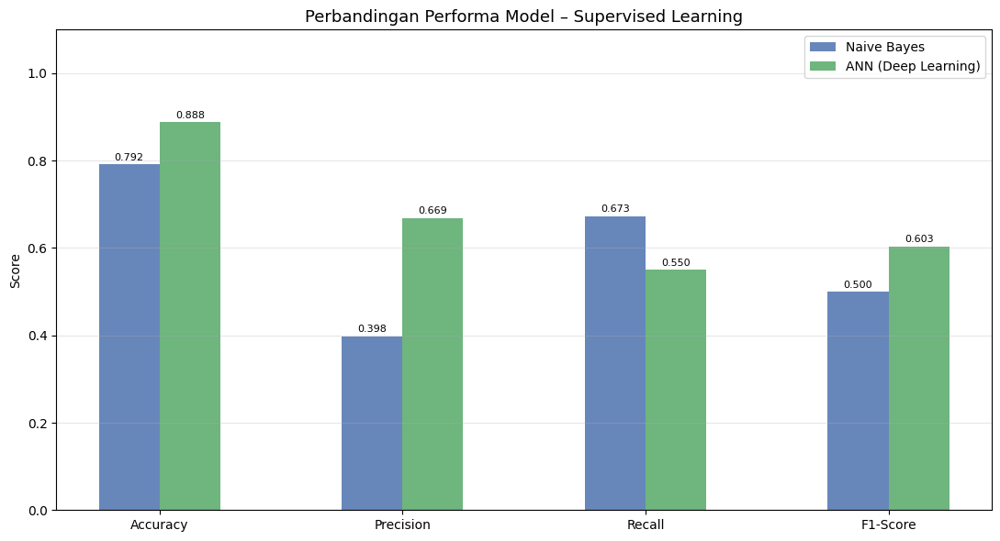

# 🛒 Integrated Machine Learning Benchmark

### Online Shoppers Purchasing Intention Dataset


> Final Examination Project - Informatics S1, Universitas Bunda Mulia · 2026

---

## 📌 Overview

This project presents an integrated machine learning benchmark on the _Online Shoppers Purchasing Intention_ dataset (12,330 sessions, 18 features). The pipeline combines **unsupervised segmentation** via K-Means Clustering with **supervised classification** using Naive Bayes and Artificial Neural Network (ANN), followed by an integration analysis examining the alignment between natural data structures and actual purchase labels.

---

## 🎯 Objectives

- Segment e-commerce users into behaviorally distinct groups using K-Means Clustering
- Benchmark a traditional model (Naive Bayes) against a modern model (ANN) on purchase intent prediction
- Analyze whether unsupervised cluster structures align with supervised target labels

---

## 📊 Dataset

| Attribute              | Detail                                             |
| ---------------------- | -------------------------------------------------- |
| **Name**               | Online Shoppers Purchasing Intention               |
| **Source**             | UCI Machine Learning Repository                    |
| **Sessions**           | 12,330                                             |
| **Features**           | 18 (10 numerical, 8 categorical)                   |
| **Target**             | Revenue (0 = no purchase, 1 = purchase)            |
| **Class Distribution** | 84.5% no purchase / 15.5% purchase                 |
| **DOI**                | [10.24432/C5F88Q](https://doi.org/10.24432/C5F88Q) |

---

## 🔧 Methodology

```
Raw Data (12,330 sessions)
          │
          ▼
┌──────────────────────┐
│    Data Engineering  │
│  · Ordinal Encoding  │
│  · Median Imputation │
│  · Winsorization     │
│  · StandardScaler    │
│  · Train-Test 80:20  │
└──────────┬───────────┘
           │
     ┌─────┴──────┐
     ▼            ▼
┌─────────┐  ┌──────────────────┐
│ K-Means │  │ Supervised Models│
│  k = 2  │  │  · Naive Bayes   │
│         │  │  · ANN           │
└─────────┘  └──────────────────┘
     │                │
     └────────┬───────┘
              ▼
┌─────────────────────────────┐
│     Integration Analysis    │
│   Cluster ↔ Revenue Label   │
└─────────────────────────────┘
```

---

## 📈 Results

### 🔵 Unsupervised — K-Means Clustering

Optimal k was determined using the **Elbow Method** and **Silhouette Score** (k = 2, score = 0.2603).





| Cluster | Segment                  | Sessions | Proportion | Conversion Rate |
| ------- | ------------------------ | -------- | ---------- | --------------- |
| 0       | Low-Engagement Visitors  | 10,292   | 83.5%      | 13.1%           |
| 1       | High-Engagement Visitors | 2,038    | 16.5%      | **27.6%**       |

> Cluster 1 exhibits a conversion rate **2.11× higher** than Cluster 0, demonstrating that K-Means successfully separates users by purchase tendency without any label supervision.

---

### 🟠 Supervised — Model Benchmarking



| Model       | Accuracy   | Precision  | Recall     | F1-Score   |
| ----------- | ---------- | ---------- | ---------- | ---------- |
| Naive Bayes | 79.16%     | 39.78%     | **67.28%** | 50.00%     |
| **ANN**     | **88.81%** | **66.88%** | 54.97%     | **60.35%** |

**Confusion Matrix:**

|           | **Naive Bayes** |         |     | **ANN**   |         |
| --------- | --------------- | ------- | --- | --------- | ------- |
|           | Pred: 0         | Pred: 1 |     | Pred: 0   | Pred: 1 |
| Actual: 0 | TN: 1,695       | FP: 389 |     | TN: 1,980 | FP: 104 |
| Actual: 1 | FN: 125         | TP: 257 |     | FN: 172   | TP: 210 |

> ✅ **ANN is recommended** as the primary model based on the highest F1-Score (60.35%), reflecting a better balance between Precision and Recall on this imbalanced dataset.  
> ⚠️ **Naive Bayes** achieves a higher Recall (67.28%) and may be preferred in business scenarios where minimizing missed conversions is the priority.

---

## 🗂️ Project Structure

```
📦 repository
 ┣ 📓 final.ipynb                        # Main notebook (all pipeline stages)
 ┣ 📄 README.md                          # Project documentation
 ┣ 📁 data/
 ┃ ┗ 📊 online_shoppers_intention.csv    # Dataset
 ┗ 📁 assets/                            # Chart screenshots from notebook
   ┣ 🖼️ elbow_method.png                 # Elbow Method chart
   ┣ 🖼️ silhouette_score.png             # Silhouette Score chart
   ┣ 🖼️ pca_cluster.png                  # PCA Cluster visualization
   ┗ 🖼️ chart_komparasi.png              # Model comparison bar chart
```

---

## 🚀 How to Run

**1. Clone the repository**

```bash
git clone https://github.com/username/repo-name.git
cd repo-name
```

**2. Install dependencies**

```bash
pip install pandas numpy scikit-learn tensorflow matplotlib seaborn
```

**3. Run the notebook**

```bash
jupyter notebook final.ipynb
```

Or open directly in Google Colab:

[](https://colab.research.google.com/github/username/repo-name/blob/main/final.ipynb)

> Replace `username/repo-name` with your actual GitHub repository path.

---

## 📚 References

| #   | Reference                                                                                                                                                                                                |
| --- | -------------------------------------------------------------------------------------------------------------------------------------------------------------------------------------------------------- |
| [1] | C. O. Sakar et al., "Real-Time Prediction of Online Shoppers' Purchasing Intention Using Multilayer Perceptron and LSTM," _Neural Comput. Appl._, 2019. [DOI](https://doi.org/10.1007/s00521-018-3523-0) |
| [2] | A. M. Ikotun et al., "K-means Clustering Algorithms: A Comprehensive Review," _Inf. Sci._, 2023. [DOI](https://doi.org/10.1016/j.ins.2022.11.139)                                                        |
| [3] | B. T. Kristanti et al., "Implementasi K-Means Clustering dalam Segmentasi Pelanggan," _JITET_, 2024. [DOI](https://doi.org/10.23960/jitet.v12i3.4677)                                                    |
| [4] | C. Zhang et al., "Online Purchase Behavior Prediction Based on RNN and Naive Bayes," _JTAER_, 2024. [DOI](https://doi.org/10.3390/jtaer19040168)                                                         |
| [5] | J. Lin, "Application of Machine Learning in Predicting Consumer Behavior and Precision Marketing," _PLOS ONE_, 2025. [DOI](https://doi.org/10.1371/journal.pone.0321854)                                 |
| [6] | F. U. Aulya & K. Kusnawi, "Evaluating Classification Models for Predicting Product Success in Indonesian E-Commerce," _JUTIF_, 2025. [DOI](https://doi.org/10.52436/1.jutif.2025.6.4.5071)               |

---

## 👥 Contributors

| Name               | Student ID |
| ------------------ | ---------- |
| **Kenisha Ellen**  | 32230114   |
| **Novandy Amcals** | 32230145   |
| **Valwa Giraldy**  | 32230178   |

---

<div align="center">
  <sub>🎓 Final Examination · Machine Learning · Informatics S1 · Universitas Bunda Mulia · 2026</sub>
</div>
